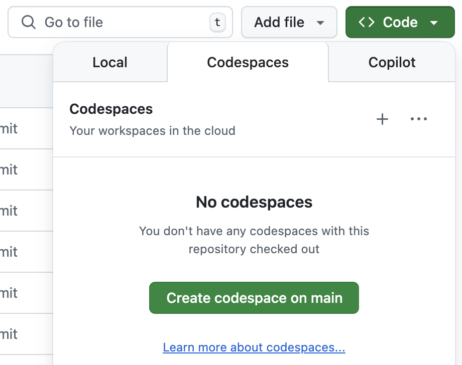
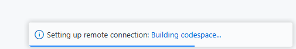
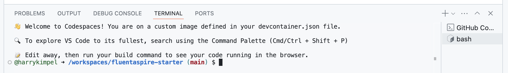
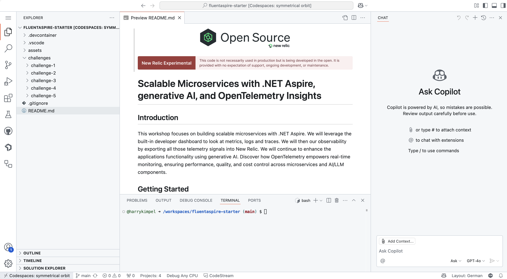

# Scalable Microservices with .NET Aspire, generative AI, and OpenTelemetry Insights

## Introduction

This workshop focuses on building scalable microservices with .NET Aspire. We will leverage the built-in developer dashboard to look at metrics, logs and traces. We will then our observability by exporting all those telemetry signals into New Relic.
We will continue to enhance the applications functionality using generative AI. Discover how OpenTelemetry empowers real-time monitoring, ensuring performance, quality, and cost control across microservices and AI/LLM components.

## Getting Started

In order to get started with this workshop, click into the `Code`, into the `Codespaces` tab and `Create codespace on main`. This will spin up your workshop environment in the browser.

After you select `Create codespace on main`, you navigate to a web-based version of Visual Studio Code. Before you use the Codespace, the containerized development environment needs to be prepared. This process happens automatically on the server and you can review progress by selecting the `Building codespace...` link on the notification in the bottom right of the browser window.

When the container image has finished being built the Terminal prompt appears which signals that the environment is ready to be interacted with.

At this point, the workshop environment has been installed and we are ready to get started exploring the environment.

The GitHub codespace environment basically consists of a VS Code instance with:

- an `Explorer` panel on the left side of the window
- the main content area where we are able to open, edit and save files
- a `Debug Console`, `Terminal` and other useful panels at the bottom
- a `Github Copilot` chat window on the right side

## Challenges

As part of this workshop, we will go through a couple different challenges each focusing on various aspects.

Let's get started with the first challenge. For this we jump into [first challenge](./challenges/challenge-1/README.md) folder.
