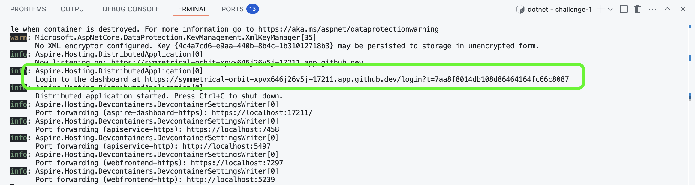

# Challenge 1

In this initial challenge we will get the .NET Aspire sample application up and running.

Follow the steps below to run the sample application:

1. Open the `Terminal` tab in the bottom panel

2. Change folder into `challenge-1` folder

    ```bash
    cd challenges/challenge-1
    ```

3. Run the sample application

    ```bash
    dotnet run --project app.AppHost/app.AppHost.csproj
    ```

Once the application is ready, you should see some output like this.


In order to get to the .NET Aspire developer dashboard, click into your `Login to the dashboard at ...` link.



The .NET Aspire dashboard then shows you an overview of all the resources involved in the sample aplication.


Clicking on the URL for the `webfrontend`, brings you into the actual web frontend of our sample application.


Play around with the app and familiarize yourself with the user interface and all of its components. I encourage you to navigate to the `Counter` and `Weather` components.

## .NET Aspire developer dashboard

Back in the .NET Aspire developer dashboard, we can then explore other areas of this dashboard:

### Console logs


### Structured logs


### Traces

- Traces overview

    

- Trace details

    

### Metrics


## OpenTelemetry as an open standard

**OpenTelemetry** is:

- An [Observability](https://opentelemetry.io/docs/concepts/observability-primer/#what-is-observability) framework and toolkit designed to create and manage telemetry data such as [traces](https://opentelemetry.io/docs/concepts/signals/traces/), [metrics](https://opentelemetry.io/docs/concepts/signals/metrics/), and [logs](https://opentelemetry.io/docs/concepts/signals/logs/).
- Vendor- and tool-agnostic, meaning that it can be used with a broad variety of Observability backends, including open source tools like Jaeger and Prometheus, as well as commercial offerings.
- Not an observability backend like Jaeger, Prometheus, or other commercial vendors.
- Focused on the generation, collection, management, and export of telemetry. A major goal of OpenTelemetry is that you can easily instrument your applications or systems, no matter their language, infrastructure, or runtime environment. The storage and visualization of telemetry is intentionally left to other tools.

## OpenTelemetry in .NET Aspire

All of these telemetry signals are captured by default using the default configuration of OpenTelemetry in .NET Aspire.

These defaults are configured in the `app.ServiceDefaults` project. Have a look into the [Extensions.cs](./app.ServiceDefaults/Extensions.cs) file. Line 20 calls a method `ConfigureOpenTelemetry` on the application builder. The different signals for logs, metrics and traces are then configured in lines 46-66. These telemetry signals are then sent into the .NET Aspire OpenTelemetry collector where these are captured and then visualized.

## Finally

When you are finished exploring, let's head to the [next challenge](../challenge-2/README.md).
