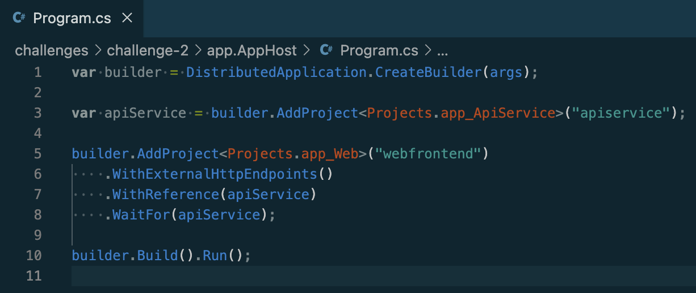
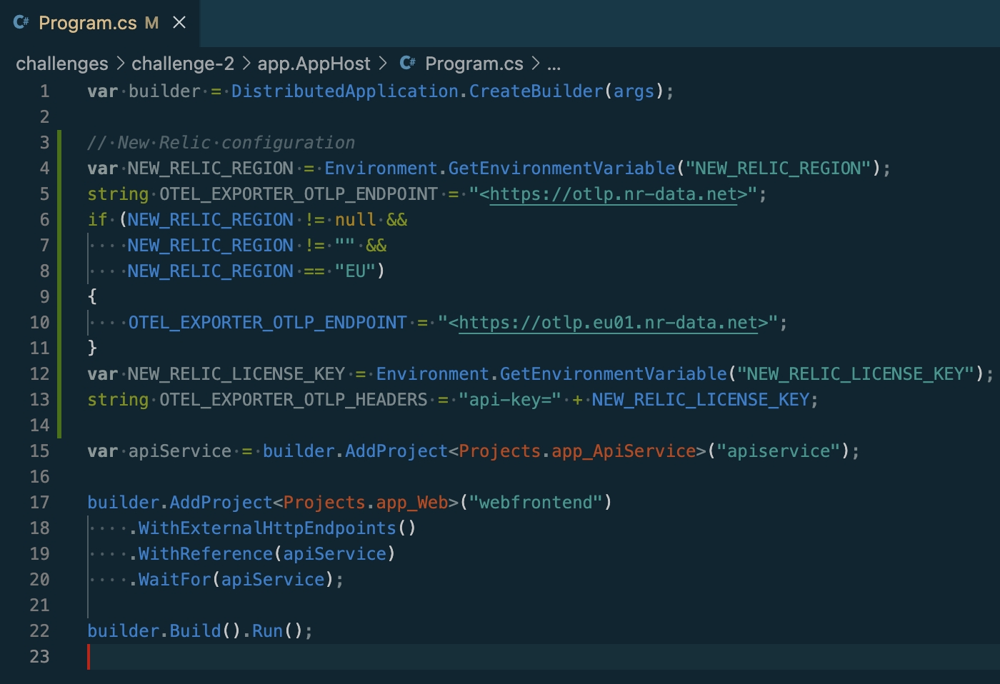
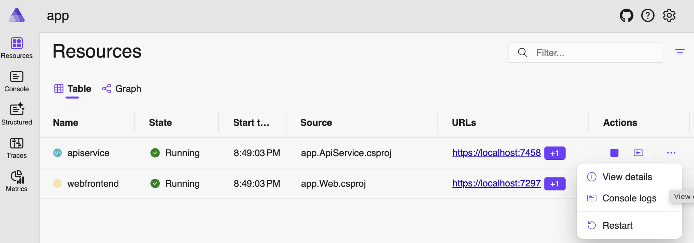
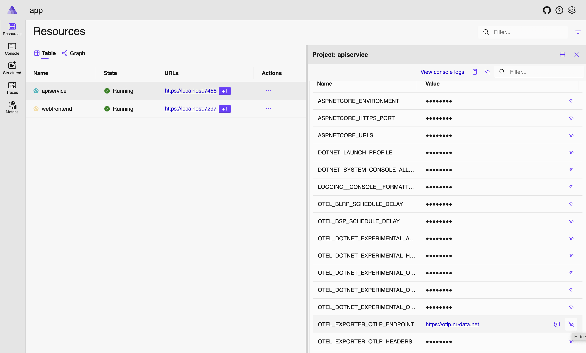
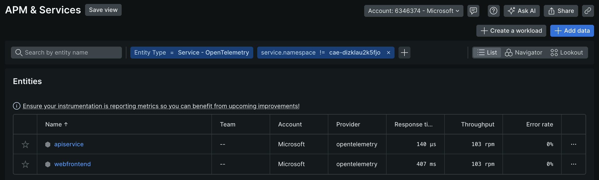
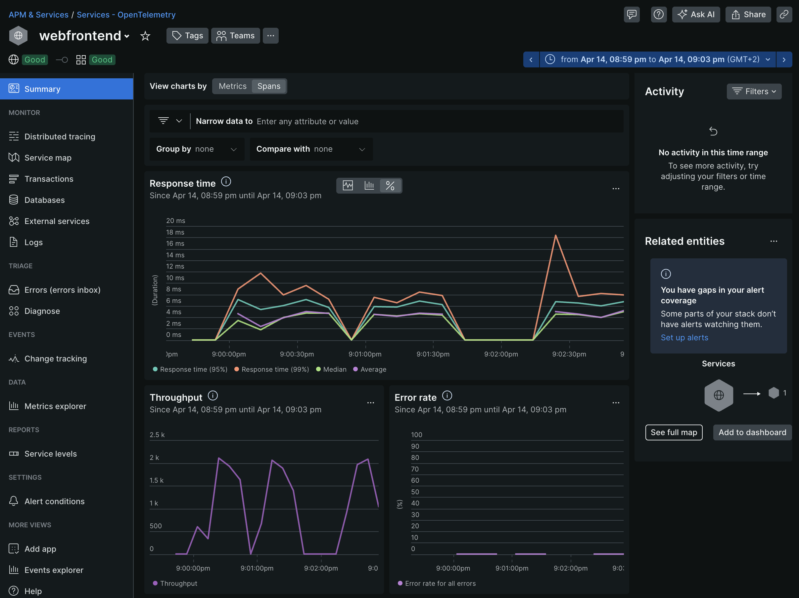
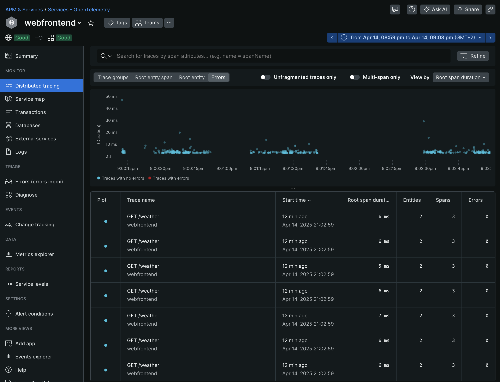
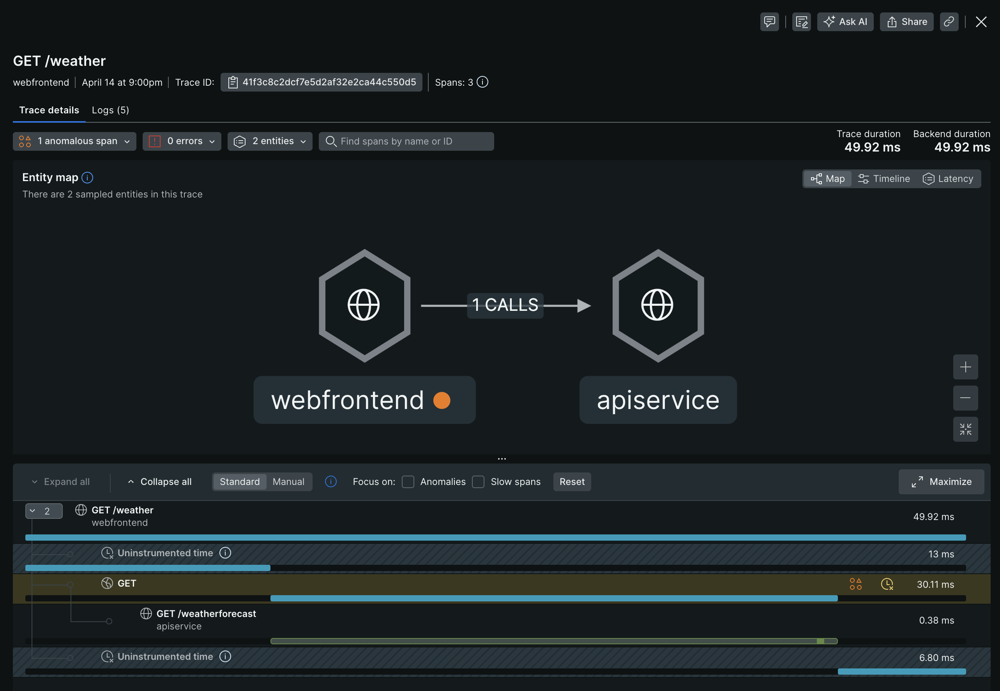
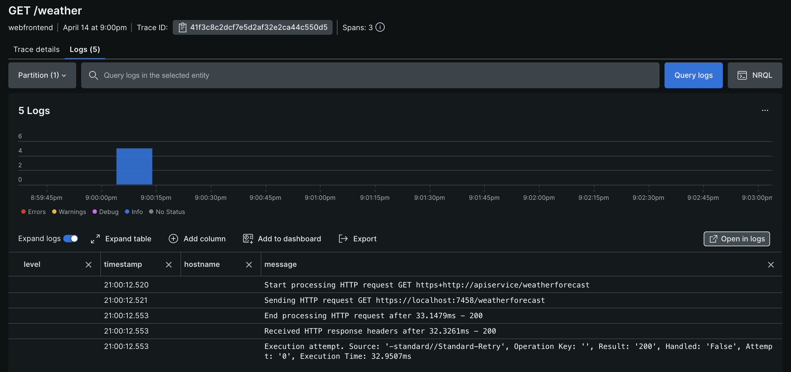
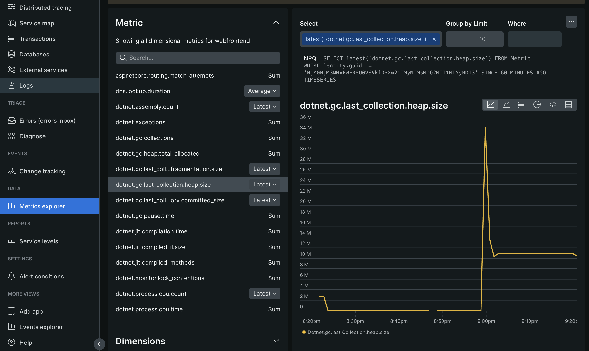

# Challenge 2

In this challenge we will export all the telemetry from our sample application into New Relic as our observability backend.

Follow the steps below:

1. Open the `Terminal` tab in the bottom panel

2. Stop the running application by hitting CTRL-C in the terminal

3. Navigate into `challenge-2` folder

    ```bash
    cd ../challenge-2
    ```

4. In the `Explorer` on the left side, open [challenges/challenge-2/app.AppHost/Program.cs](app.AppHost/Program.cs)

## .NET Aspire orchestration overview

.NET Aspire provides APIs for expressing resources and dependencies within your distributed application (please find more information [here](https://learn.microsoft.com/en-us/dotnet/aspire/fundamentals/app-host-overview)).

In our sample application, we first create a distributed application builder. We then add our two projects as references to the application builder. As you can see, we can also express dependencies between these services as you can see in the webfrontend reference.



## Exporting OpenTelemetry signals to an observability backend like New Relic

Now that we have looked into the default telemetry signals that are being capture and visualized in the .NET Aspire developer dashboard, let's see how we can export these signals into a full observability backend New Relic.

The first step is to define some variables that we will use to add as paramaters in our orchestration.

In the [Program.cs](app.AppHost/Program.cs) in line 2, add the following code snippet:

```csharp
// New Relic configuration
var NEW_RELIC_REGION = Environment.GetEnvironmentVariable("NEW_RELIC_REGION");
string OTEL_EXPORTER_OTLP_ENDPOINT = "https://otlp.nr-data.net";
if (NEW_RELIC_REGION != null &&
    NEW_RELIC_REGION != "" &&
    NEW_RELIC_REGION == "EU")
{
    OTEL_EXPORTER_OTLP_ENDPOINT = "https://otlp.eu01.nr-data.net";
}
var NEW_RELIC_LICENSE_KEY = Environment.GetEnvironmentVariable("NEW_RELIC_LICENSE_KEY");
string OTEL_EXPORTER_OTLP_HEADERS = "api-key=" + NEW_RELIC_LICENSE_KEY;
```

The code should look similar to this:



As you can see, we will have to define some environment variables later before we start the application. But let's first continue our configuration in the .NET Aspire orchestration.

In the section were we define the `api service` (line 15 now), let's add in some configuration for this service. Replace the entire line with the following content:

```csharp
var apiServiceName = "apiservice";
var apiService = builder.AddProject<Projects.app_ApiService>(apiServiceName)
    .WithEnvironment("OTEL_EXPORTER_OTLP_ENDPOINT", OTEL_EXPORTER_OTLP_ENDPOINT)
    .WithEnvironment("OTEL_EXPORTER_OTLP_HEADERS", OTEL_EXPORTER_OTLP_HEADERS)
    .WithEnvironment("OTEL_SERVICE_NAME", apiServiceName)
    .WithEnvironment("OTEL_RESOURCE_ATTRIBUTES", "service.name="+apiServiceName+",service.version=1.0.0,service.instance.id="+apiServiceName);
```

Similarly, we will also update the `web frontend` service:

```csharp
var webFrontendName = "webfrontend";
builder.AddProject<Projects.app_Web>(webFrontendName)
    .WithExternalHttpEndpoints()
    .WithReference(apiService)
    .WaitFor(apiService)
    .WithEnvironment("OTEL_EXPORTER_OTLP_ENDPOINT", OTEL_EXPORTER_OTLP_ENDPOINT)
    .WithEnvironment("OTEL_EXPORTER_OTLP_HEADERS", OTEL_EXPORTER_OTLP_HEADERS)
    .WithEnvironment("OTEL_SERVICE_NAME", webFrontendName)
    .WithEnvironment("OTEL_RESOURCE_ATTRIBUTES", "service.name="+webFrontendName+",service.version=1.0.0,service.instance.id="+webFrontendName);
```

What is it that we actually configured above? Basically, we passed in some additional environment variables into the project configuration. All of these variables are based on standard [OpenTelemetry configuration options](https://opentelemetry.io/docs/languages/sdk-configuration/otlp-exporter/).

- **OTEL_EXPORTER_OTLP_ENDPOINT**: A base endpoint URL for any signal type, with an optionally-specified port number. We are using the native OpenTelemetry OTLP (OpenTelemetry Line Protocol) endpoint from New Relic here.

- **OTEL_EXPORTER_OTLP_HEADERS**: A list of headers to apply to all outgoing data (traces, metrics, and logs). In our case, we pass in a New Relic license key as an API key into the exporter configuration.

- **OTEL_SERVICE_NAME**: Sets the value of the `service.name` resource attribute. If `service.name` is also provided in `OTEL_RESOURCE_ATTRIBUTES`, then `OTEL_SERVICE_NAME` takes precedence.

- **OTEL_RESOURCE_ATTRIBUTES**: Key-value pairs to be used as resource attributes. See [Resource SDK](https://opentelemetry.io/docs/specs/otel/resource/sdk#specifying-resource-information-via-an-environment-variable) for more details.

## Run the application

Before we are able to execute our application, we have to define the [New Relic license key](https://docs.newrelic.com/docs/apis/intro-apis/new-relic-api-keys/#license-key) as an environment variable (you can [get/create a license key here](https://one.newrelic.com/launcher/api-keys-ui.api-keys-launcher)):

```bash
export NEW_RELIC_LICENSE_KEY=YOUR_NEW_RELIC_LICENSE_KEY
```

Let's run the application again and see what result we can achieve.

```bash
dotnet run --project app.AppHost/app.AppHost.csproj
```

Once the application is up and running again, let's explore the .NET Aspire developer dashboard again. You will notice that the `Resources` page looks pretty much the same and list all of our services. However, the `Structured Logs`, `Traces` and `Metrics` sections appear emtpty and not showing any telemetry signals anymore.

The reason for that can be found by looking into the details of either the apiservice or the webfrontend.



Looking at the environment variables:



## Observing our application in New Relic

All telemetry signals - logs, metrics and traces - are now exported into New Relic. Let's explore ...

The overview page across all our services shows some high-level performance metrics.



Now let's click into the `webfrontend`. This brings us into the summary page of that service.



From here, we can then dive deeper into the logs, metrics and traces. Let's start with `Distributed tracing`. The below screen shows a scatter chart of all the traces we captured in the given time window.



From here we can click into a single trace.



OpenTelemetry automatically links logs to single traces by adding the trace.id to a log entry. Click into a single log line to explore.



Finally, also all metrics for any given service can easily be analyzed:



## Finally

When you are finished exploring, let's head to the [next challenge](../challenge-3/README.md).
