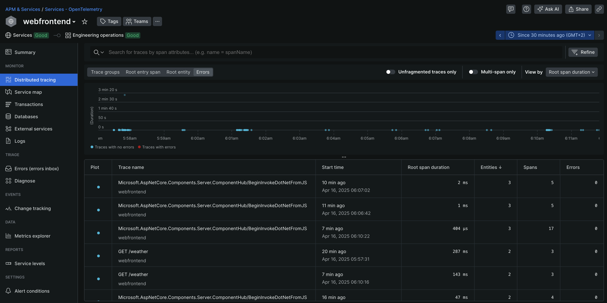
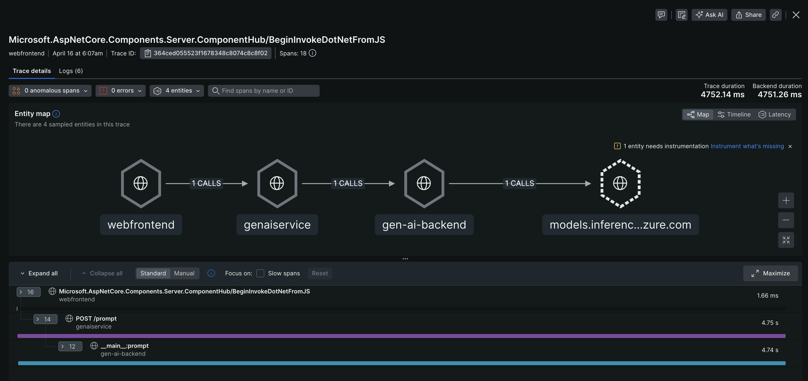
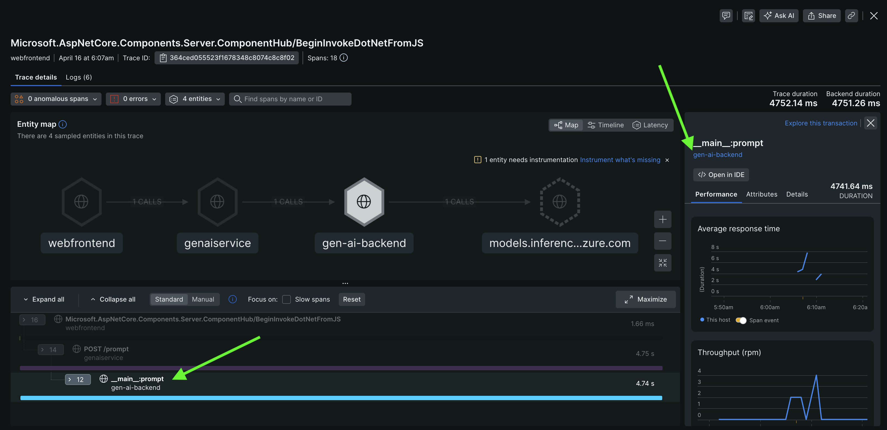
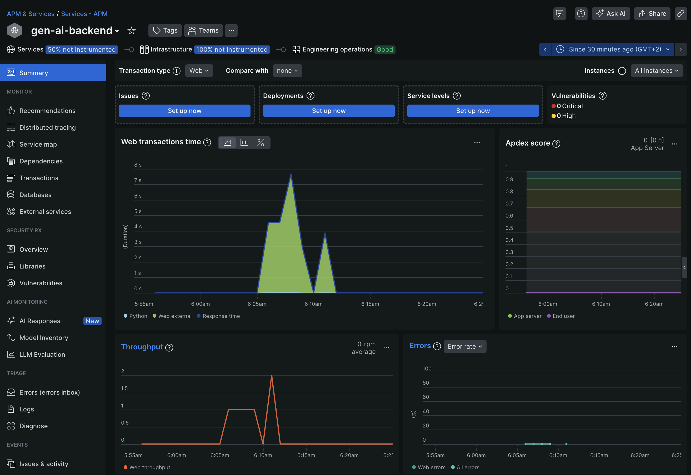
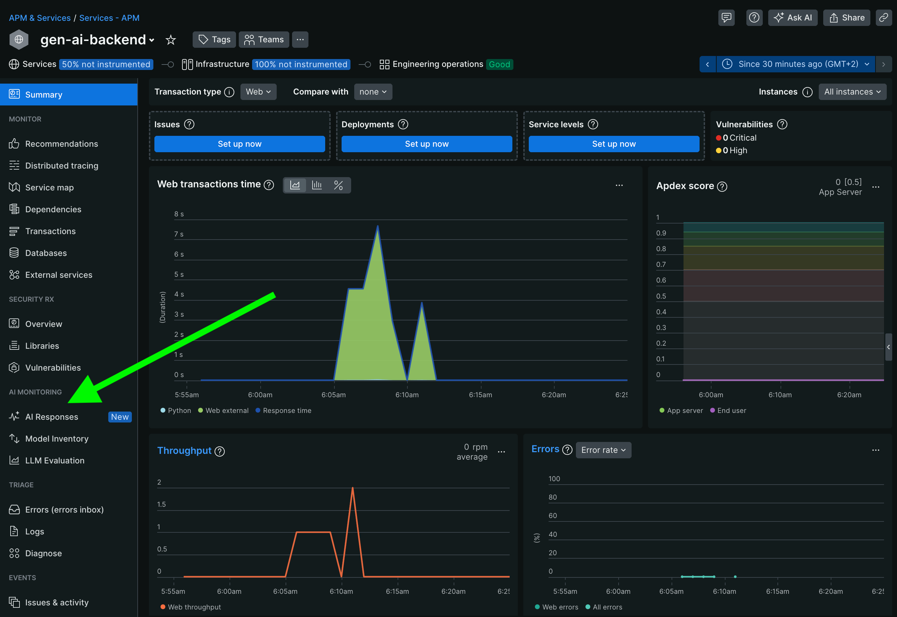
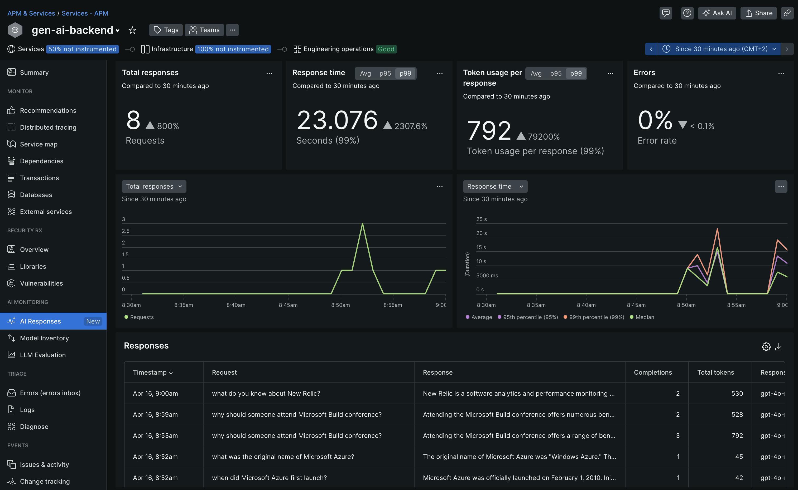
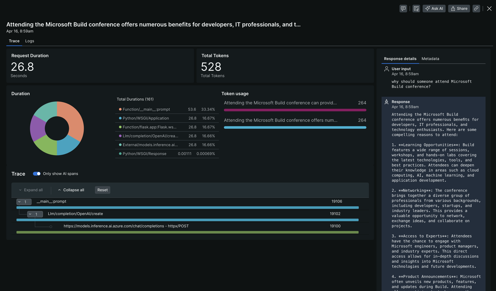
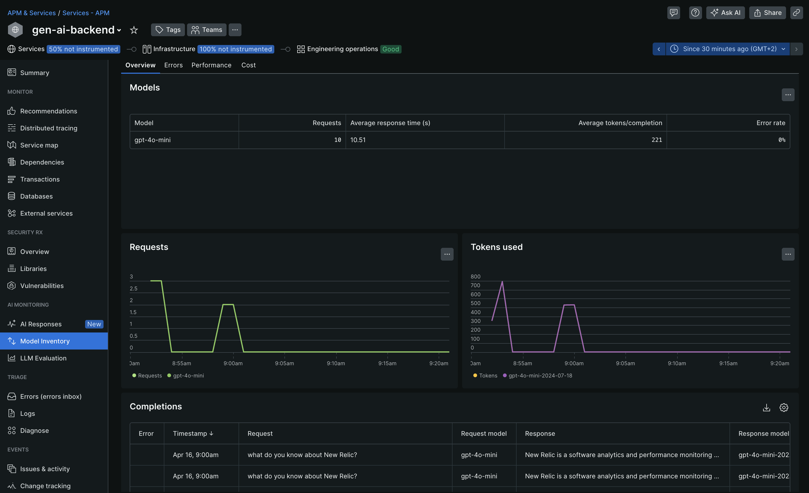

# Challenge 3

This challenge focuses on adding generative AI into our application.

Follow the steps below:

1. Open the `Terminal` tab in the bottom panel

2. Stop the running application by hitting CTRL-C in the terminal

3. Navigate into `challenge-3` folder and specifically into the `aspire` folder

    ```bash
    cd ../challenge-3/aspire
    ```

4. In the bottom panel, click on the `+` sign and create another `bash` terminal window.

    

5. In the second terminal, navigate into `gen-ai` folder within `challenge-3`

    ```bash
    cd challenges/challenge-3/gen-ai/
    ```

## Challenge background

As mentioned earlier, we will now also leverage generative AI into our application and see what valuable information we can achieve by monitoring the AI/LLM specifically. Our first terminal still holds our .NET Aspire sample application. However, this time we added in an additional service to interact with another service running outside of our .NET Aspire application. You'll notice that there is another service, the `app.GenAIApiService`. All it does is basically making a POST request to our gen-AI backend service running on `http://localhost:5004`.

This other service (to be executed in the second terminal window) is a Python application that exposes a `/prompt` endpoint and accepts a prompt that is sent to our GitHub marketplace models by calling `https://models.inference.ai.azure.com` along with your GitHub personal access token (PAT).

## Run the application

Before we are able to execute our application, we have to define the [New Relic license key](https://docs.newrelic.com/docs/apis/intro-apis/new-relic-api-keys/#license-key) as an environment variable (you can [get/create a license key here](https://one.newrelic.com/launcher/api-keys-ui.api-keys-launcher)):

### .NET Aspire application

In the first terminal window, execute the below commands:

```bash
export NEW_RELIC_LICENSE_KEY=YOUR_NEW_RELIC_LICENSE_KEY
```

Let's execute the application.

```bash
dotnet run --project app.AppHost/app.AppHost.csproj
```

### Python generative AI application

In the second terminal window, execute the below commands:

```bash
export NEW_RELIC_LICENSE_KEY=YOUR_NEW_RELIC_LICENSE_KEY
```

You can re-use the same New Relic license key as before. This way, the same New Relic account will contain both the .NET Aspire app as well as the Python AI/LLM backend application.

We also need to define our `GITHUB_TOKEN` (PAT) in order to make requests to the `https://models.inference.ai.azure.com` service. Create your PAT token by following instructions [here](https://docs.github.com/en/authentication/keeping-your-account-and-data-secure/managing-your-personal-access-tokens).

```bash
export GITHUB_TOKEN=YOUR_GITHUB_TOKEN
```

Finally, we also need to define the AI/LLM model to use. We will leverage `=gpt-4o-mini` for this. Execute the below command in the second terminal.

```bash
export MODEL="gpt-4o-mini"
```

Let's execute the application.

```bash
python3 -m venv .venv
source .venv/bin/activate
pip install -r requirements.txt
NEW_RELIC_CONFIG_FILE=newrelic.ini newrelic-admin run-program flask --app app.py run --host 0.0.0.0 --port 5004
```

## Investigate our application

In the output of the first terminal panel, we should again see a link to our .NET Aspire dashboard:


Click on the dashboard link and navigate to the `webfrontend` service.

Here, you'll notice a new navigation item called `Gen-AI`.


Here, you are able to enter some prompts and receive responses from the AI/LLM model being visualized in the web frontend.

Below please find some sample prompts that you could use:

- Tell me more about .NET Aspire
- What are the unique selling points of Microsoft Azure?
- What are the different options/regions Microsoft Azure offers in Germany?
- When did Microsoft Azure first launch?
- What was the original name of Microsoft Azure?
- Why should developers attend Microsoft Build conference?
- What do you know about New Relic?
- Who invented New Relic?
- Where does the name 'New Relic' come from?

## Observability of our .NET Aspire and generative AI application

Let's look into New Relic and checkout the `Distributed Tracing` section of the `webfrontend` service as part of our .NET Aspire app.



Select any of the traces that with the name `Microsoft.AspNetCore.Components.Server.ComponentHub/BeginInvokeDotNetFromJS` that each have 3 entities involved.



You will notice that we are able to capture the entire trace all the way from the `webfrontend` to the `genaiservice` to the `gen-ai-backend` and finally calling out to `odels.inference.ai.azure.com`. OpenTelemetry and our New Relic Python agent work in concert to make this entire trace visible end-to-end.

Next, we click on the span `__main__:prompt` of the `gen-ai-backend`.



This brings us into the `Summary` screen of the `gen-ai-backend` service.



From here we can easily analyze and investigate all the performance metrics of this specific service.

## New Relic AI Monitoring

However, for this workshop, we are specifically interested in the `AI Monitoring` section.



### AI Responses

One of the aspects of [New Relic AI Monitoring](https://newrelic.com/platform/ai-monitoring) is the `AI Responses` section:



This page shows a summary of all the AI/LLM interactions in the selected time window. We highlight the following aspects:

- **Total Responses**: the number of total responses in the selected time window.
- **Response time**: the duration of requests to our AI/LLM (99th and 95thpercentile and average).
- **Token usage per response**: how many tokens are consumed per response (99th and 95thpercentile and average).
- **Errors**: error rate focusing specifically on the AI/LLM interactions.
- **Responses**: this list view shows the actual requests and responses being sent to our AI/LLM interaction. It also highlights details about the total completions, the tokens and the actual model being used for the interaction.

When clicking into any of the items in the `Responses` list view, we are able to investigate a single interaction even further.



From here we can analyze where the time is spent in a given interaction from our end users with the AI/LLM application we are monitoring.

### Model Inventory

Another aspect of New Relic AI monitoring is the `Model Inventory`.



This section allows you to get an overview for this specific service about the various AI/LLM models being used including details about:

- the total requests
- average response time
- average number of tokens per completion
- error rate

This section will become way more interesting once we configured and used other models in our application.

## Finally

When you are finished exploring, let's head to the [next challenge](../challenge-4/README.md).
