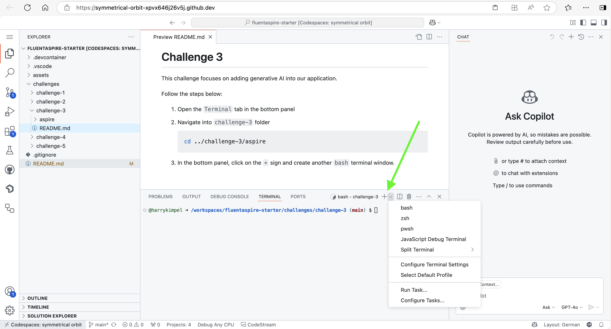
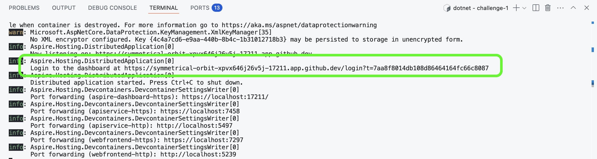
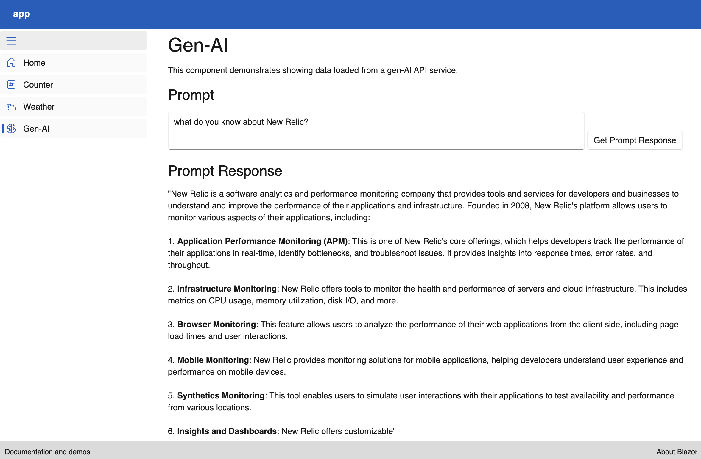

# Challenge 3

This challenge focuses on adding generative AI into our application.

Follow the steps below:

1. Open the `Terminal` tab in the bottom panel

2. Navigate into `challenge-3` folder and specifically into the `aspire` folder

    ```bash
    cd ../challenge-3/aspire
    ```

3. In the bottom panel, click on the `+` sign and create another `bash` terminal window.

    

4. In the second terminal, navigate into `gen-ai` folder within `challenge-3`

    ```bash
    cd ../challenge-3/gen-ai
    ```

## Challenge background

As mentioned earlier, we will now also leverage generative AI into our application and see what valuable information we can achieve by monitoring the AI/LLM specifically. Our first terminal still holds our .NET Aspire sample application. However, this time we added in an additional service to interact with another service running outside of our .NET Aspire application. You'll notice that there is another service, the `app.GenAIApiService`. All it does is basically making a POST request to our gen-AI backend service running on `http://localhost:5004`.

This other service (to be executed in the second terminal window) is a Python application that exposes a `/prompt` endpoint and accepts a prompt that is sent to our GitHub marketplace models by calling `https://models.inference.ai.azure.com` along with your GitHub personal access token (PAT).

## Run the application

Before we are able to execute our application, we have to define the [New Relic license key](https://docs.newrelic.com/docs/apis/intro-apis/new-relic-api-keys/#license-key) as an environment variable (you can [get/create a license key here](https://one.newrelic.com/launcher/api-keys-ui.api-keys-launcher)):

### .NET Aspire application

In the first terminal window, execute the below commands:

```bash
export NEW_RELIC_LICENSE_KEY=YOUR_NEW_RELIC_LICENSE_KEY
```

Let's execute the application.

```bash
dotnet run --project app.AppHost/app.AppHost.csproj
```

### Python generative AI application

In the second terminal window, execute the below commands:

```bash
export NEW_RELIC_LICENSE_KEY=YOUR_NEW_RELIC_LICENSE_KEY
```

We also need to define our `GITHUB_TOKEN` (PAT) in order to make requests to the `https://models.inference.ai.azure.com` service. Create your PAT token by following instructions [here](https://docs.github.com/en/authentication/keeping-your-account-and-data-secure/managing-your-personal-access-tokens).

```bash
export GITHUB_TOKEN=YOUR_GITHUB_TOKEN
```

Let's execute the application.

```bash
pip install -r requirements.txt
NEW_RELIC_CONFIG_FILE=newrelic.ini newrelic-admin run-program flask --app app.py run --host 0.0.0.0 --port 5004
```

## Investigate our application

In the output of the first terminal panel, we should again see a link to our .NET Aspire dashboard:



Click on the dashboard link and navigate to the `webfrontend` service.

Here, you'll notice a new navigation item called `Gen-AI`.



Here, you are able to enter some prompts and receive responses from the AI/LLM model visualized in the user interface.
