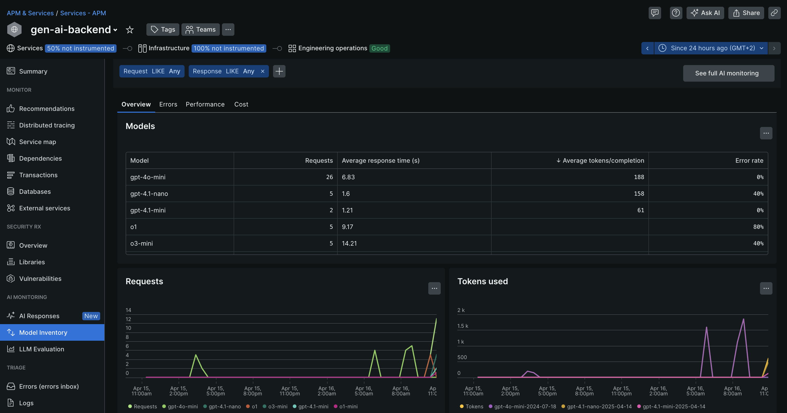
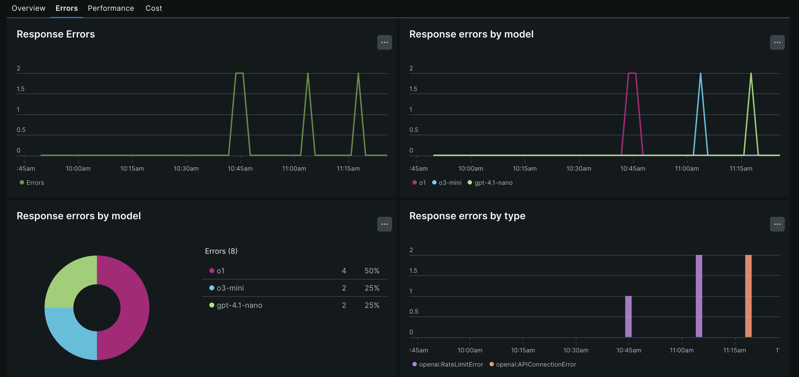
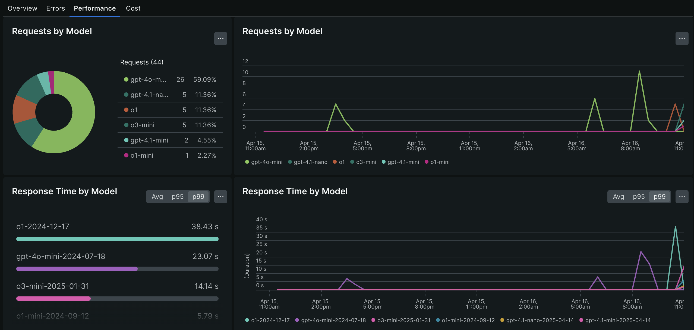
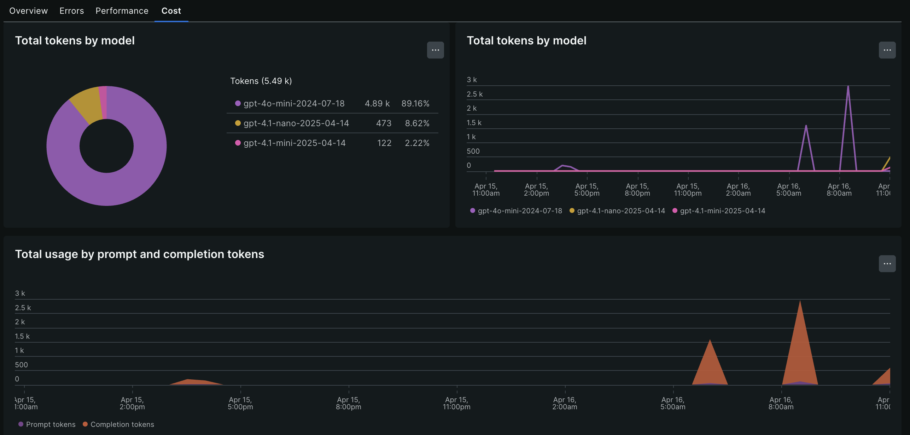

# Challenge 4

This challenge focuses on leveraging various different AI/LLM models in our application.

Follow the steps below:

1. Open the first `Terminal` tab in the bottom panel

2. Stop the running application by hitting CTRL-C in the terminal

3. Navigate into `challenge-4` folder and specifically into the `aspire` folder

    ```bash
    cd ../challenge-4/aspire
    ```

4. Open the second `Terminal` tab in the bottom panel

5. Stop the running application by hitting CTRL-C in the terminal

6. In the second terminal, navigate into `gen-ai` folder within `challenge-4`

    ```bash
    cd ../challenge-4/gen-ai
    ```

## Challenge background

This challenge is all about the model inventory of the New Relic AI monitoring capabilities. This is especially interesting if you are unsure about what the optimal AI/LLM model is for your specific use case you are building/running. The focus could be on using the **fastest response time** from your LLM (or even small language model or SLM, but for the sake of simplicity, we refer to these as LLMs going forward). Here is a list of aspects that you may want to consider when evaluating different models:

- **performance**: how fast does the model respond to requests
- **cost**: the cost (how many tokens are consumed) of running your application can greatly vary based on the model you use
- **quality**: the quality of the responses from your LLM

## Adjusting the AI/LLM model to `gpt-4.1-mini"`

In the second terminal of our GitHub codespace, execute the following command:

```bash
export MODEL="gpt-4.1-mini""
```

## Run the application

### .NET Aspire application

Let's execute the application.

```bash
dotnet run --project app.AppHost/app.AppHost.csproj
```

### Python generative AI application

Let's execute the application.

```bash
NEW_RELIC_CONFIG_FILE=newrelic.ini newrelic-admin run-program flask --app app.py run --host 0.0.0.0 --port 5004
```

## Interact with our AI application

In order to leverage the new AI/LLM model that we configured, let's submit some prompts and see the responses from the new model.

I encourage you to use the same or similar prompts in this challenge as you did previously. This way we will have better results to compare with in our model inventory section in New Relic.

Below please find some sample prompts that you could use:

- "Tell me more about .NET Aspire"
- "What are the unique selling points of Microsoft Azure?"
- "What are the different options/regions Microsoft Azure offers in Germany?"
- "When did Microsoft Azure first launch?"
- "What was the original name of Microsoft Azure?"
- "Why should developers attend Microsoft Build conference?"
- "What do you know about New Relic?"
- "Who invented New Relic?"
- "Where does the name 'New Relic' come from?"

Once you are happy with your prompts and received some responses, let's continue with the next section.

## Adjusting the AI/LLM model to `gpt-4.1-nano`

In the second terminal of our GitHub codespace, execute the following commands:

1. Stop the running application by hitting CTRL-C in the terminal

2. Setting the MODEL environment variable to `gpt-4.1-nano`

    ```bash
    export MODEL="gpt-4.1-nano"
    ```

3. Execute the application.

    ```bash
    NEW_RELIC_CONFIG_FILE=newrelic.ini newrelic-admin run-program flask --app app.py run --host 0.0.0.0 --port 5004
    ```

Once the application is up and running again, let's head to the `webfrontend` user interface and execute some prompts again.

I encourage you to use the same or similar prompts in this challenge as you did previously. This way we will have better results to compare with in our model inventory section in New Relic.

Below please find some sample prompts that you could use:

- "Tell me more about .NET Aspire"
- "What are the unique selling points of Microsoft Azure?"
- "What are the different options/regions Microsoft Azure offers in Germany?"
- "When did Microsoft Azure first launch?"
- "What was the original name of Microsoft Azure?"
- "Why should developers attend Microsoft Build conference?"
- "What do you know about New Relic?"
- "Who invented New Relic?"
- "Where does the name 'New Relic' come from?"

Once you are happy with your prompts and received some responses, let's continue with the next section.

## New Relic AI Monitoring - Model Inventory

Let's head into our New Relic account and visit the `Model Inventory` section.



This section provides an overview across all the different AI/LLM models the application used in the selected time window. The model overview provides information about:

- the name of the request model
- the number of requests a specific model has received
- the average response time per model
- the average tokens per completion
- the error rate

The `Errors` tab within the `Model Inventory` provides more detailed insights into any errors you may have seen while interacting with the generative AI aspect of your application.



The `Performance` tab allows you to analyze the response times broken down by model.



Finally, the `Cost` tab provides further details about token consumption by model, per prompt and by completion.



## Finally

When you are finished exploring, let's head to the [next challenge](../challenge-5/README.md).
