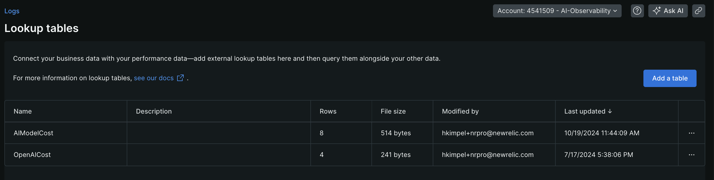
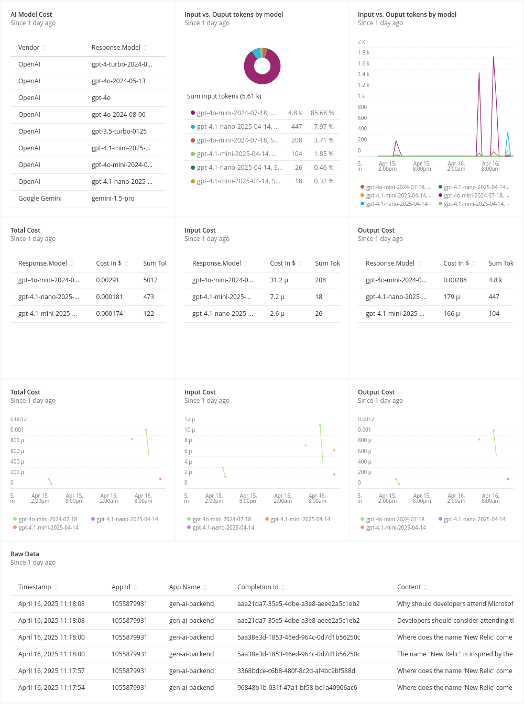

# Challenge 5

This final challenge covers some aspects of gathering some additional insights into the actual cost in Dollars ($) for the different models that we used.

## Lookup tables and custom dashboards

A nice feature of the New Relic platform is the capability to add lookup tables as part of the Logs section. In this case, I created a lookup table that includes the actual [Gemini pricing](https://ai.google.dev/pricing#1_5flash) or [OpenAI costs](https://openai.com/api/pricing/) of running the different AI models. I created a [CSV file](./model-cost-lookup-table.csv) as part of the GitHub repository that you can use to import into your New Relic account.



This lookup table basically represents some static information that you then can use to reference for example in custom dashboards. For the next step, it is best to save this CSV locally on your machine.

## Upload the CSV as a New Relic Lookup table

1. Head into your [New Relic account](https://one.newrelic.com)
2. Select the **Logs** section. Click **Lookup tables** in the second level navigation area.
3. Click on **Add a table** button
4. Provide **AIModelCost** as the name of the table.
5. Follow the steps to select your local CSV and click **Add**

## Insert a custom dashboard

I also provided an [example dashboard](./dashboard-lookup-table.json) that leverages that lookup table and joins it with the AI monitoring data that we collected. You can use the JSON representation of the dashboard and import it into your New Relic account as well.

> [!NOTE]
> Please update all of the placeholders that reference `NEW_RELIC_ACCOUNT_ID` in `JSON` with your actual New Relic account ID.

You can go to [http://one.newrelic.com](http://one.newrelic.com) to find out your New Relic account ID. If you click on your user name in the bottom left of your New Relic account and then `API Keys`. In the list of API keys you will find the account ID.

Alternatively, you will also find the account ID as part of the New Relic URL in the `account` parameter.

Or by running the below command in the [button label="Terminal"](tab-0) tab. Be sure to replace `NEW_RELIC_USER_API_KEY` with a user API key from your New Relic account.

```bash
curl https://api.newrelic.com/graphql \
  -H 'Content-Type: application/json' \
  -H 'Api-Key: NEW_RELIC_USER_API_KEY' \
  --data-binary '{"query": "{  actor {    user {      name    }  accounts {      id      name    }  }}" }'
```

Run the following command in the [button label="Terminal"](tab-0) tab in order to replace `NEW_RELIC_ACOOUNT_ID` with your New Relic account ID in `dashboard.json` file.

```bash
sed -i -e "s/YOUR_NEW_RELIC_ACCOUNT_ID/1234567/g" dashboard-lookup-table.json
```

After you ran the command, you can copy the entire dashboard JSON representation into the clipboard. Now, head to your New Relic account, click into the `Dashboards` section and select `Import dashboard` on the top right side of the screen.

Once you imported the dashboard, you can then look at a similar result as shown below. The dashboard takes the actual tokens used throughout your interaction with the chat service and multiplies it with the data from the AI cost lookup table.




## Finally

After completing this last section, you successfully finished the workshop. Congratulations!
